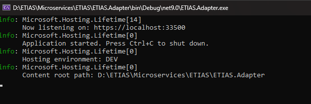
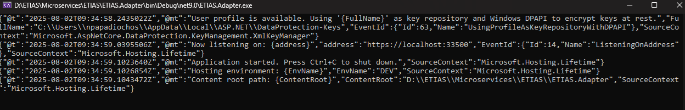

## Intro

When you consistently use a specific structured message format across all your application logs, this is known as Structured Logging.

For example <b>CLEF</b> (<b>C</b>ompact <b>L</b>og <b>E</b>vent <b>F</b>ormat - [https://clef-json.org](https://clef-json.org/), is an example of such a structured message format.

This approach ensures that every log entry follows the same structure, making it easier to search, filter, and analyze your logs efficiently.

## How do Structured Logs look?

The default console of a .NET app looks like this:



Even though these logs have some structure - i.e. you can see the severity level at the start of each line, these are not structured logs. They look more like a big chunk of text. It's not that you cannot parse these logs at all, it's that it's hard to distinguish where each entry stops and where the next one begins.

Instead, in .NET you can use the Serilog library, which by default supports the CLEF format, to generate structured logs in JSON format, so you can convert the above default console into something like this:



This is an example of Structured Logging, where we can clearly distinguish each part of the log entry:
* @t for Timestamp of each log
* @md for Message Template, etc.

Of course, it's not comfortable to read logs like these. They look very verbose, and there is no color syntax.

> What we typically do is to keep the old, good classic logs in the console and also push the structured logs into a file for further processing.

Unstructured logs are good during development and for general troubleshooting.
If you need log analytics, to determine patterns in your logs or to detect a hard bug in a distributed app, then structured logs are the way to go.

Structured Logs are meant to be processed and indexed by log analysis, aggregation and visualization tools, like OpenSearch.

## Setup

1) Install this nuget: `Serilog.AspNetCore`

2) In `program.cs`:

```csharp
var builder = WebApplication.CreateBuilder(args);

var configuration = builder.Configuration;

Serilog.Debugging.SelfLog.Enable(Console.Error);

Log.Logger = new LoggerConfiguration()
    .ReadFrom.Configuration(configuration)
    .CreateLogger();

builder.Host.UseSerilog();
```

3) In `appsettings.json` place this configuration:

```json
"Serilog": {
  "Using": [
    "Serilog.Sinks.Console",
    "Serilog.Sinks.File"
  ],
  "MinimumLevel": "Debug",
  "WriteTo": [
    {
      "Name": "Console"
    },
    {
      "Name": "File",
      "Args": {
        "path": "logs/yourApp.log",
        "rollingInterval": "Day",
        "rollOnFileSizeLimit": true,
        "formatter": "Serilog.Formatting.Compact.CompactJsonFormatter, Serilog.Formatting.Compact"
      }
    }
  ]
}
```

The big thing in this configuration, is the use of the `CompactJsonFormatter`.

## How to Use

Notihng changes from this point and on, you simply inject a `Microsoft.Extensions.Logging.ILogger` into your class and then you use the logger, as you already do:

```csharp
public class Sender(ILogger<Sender> logger)
{
  var endpoint = "http://localhost:4000";
  logger.LogInformation("Sending Request to: {endpoint}.", endpoint);
}
```

Do you use Structured Logs in your apps ?
